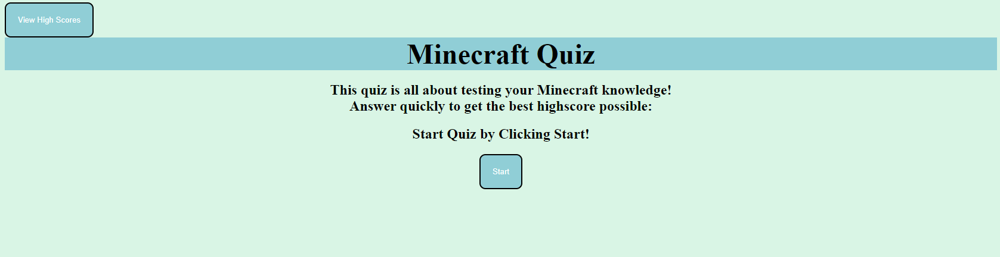
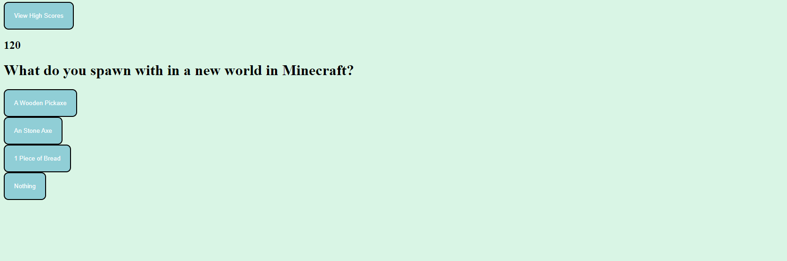
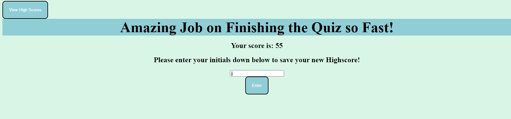

# JavaScript-Quiz

## Link to Deployed Application

https://milywayz.github.io/JavaScript-Quiz/

## Description

The purpose of this webpage is making a quiz mostly out of JavaScript with some HTML and CSS. The user will click the start button and be presented with
 a question to answer and a timer. Go throughout the quiz to answer the questions the best you can until you finish the last one. Then you will submit your
  your initials to store your high score on a different tab.

## Installation

N/A

## Usage
Start Of Quiz

Quiz Section

Finished the Quiz

   
## License

N/A

## Features

-Working timer 
-Functioning quiz 
-High-Score Display
